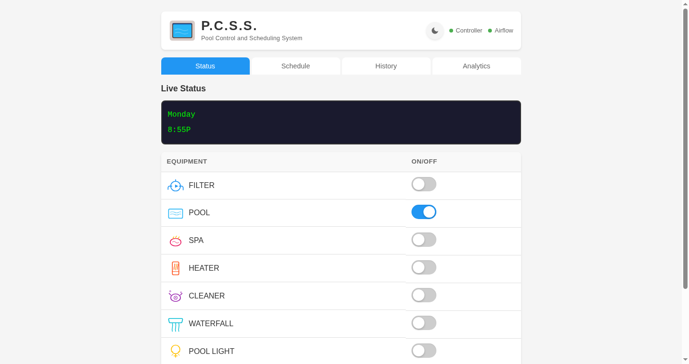
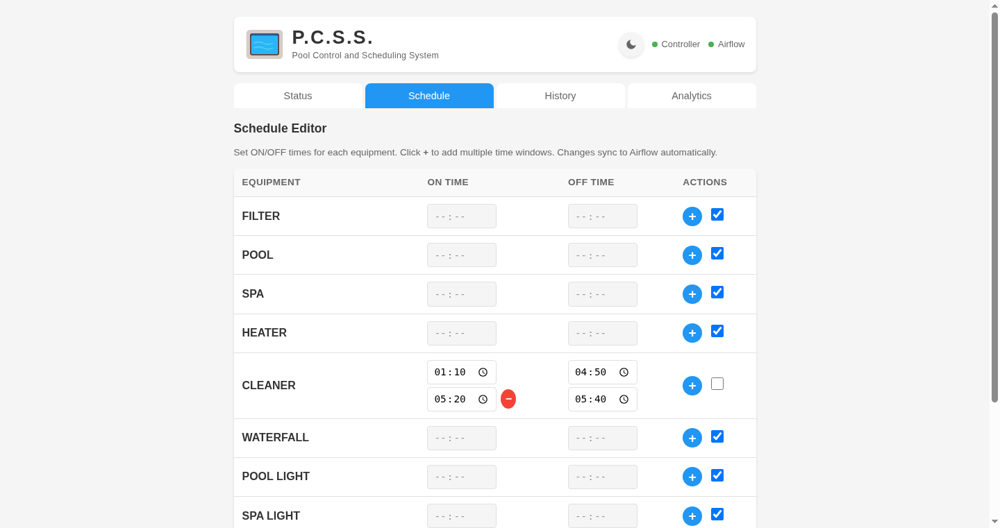
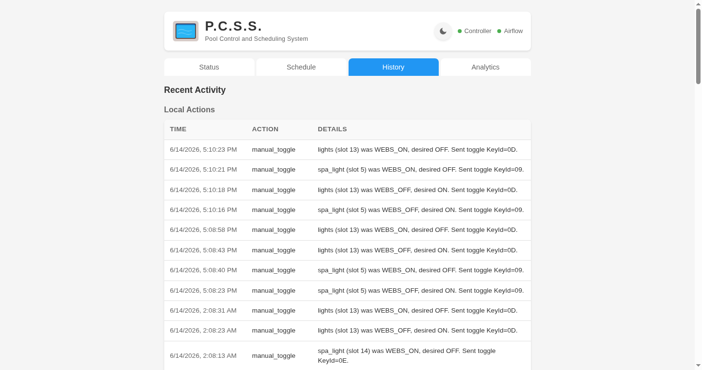
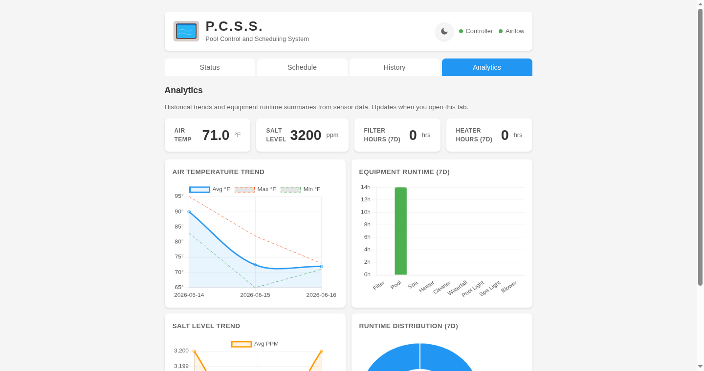
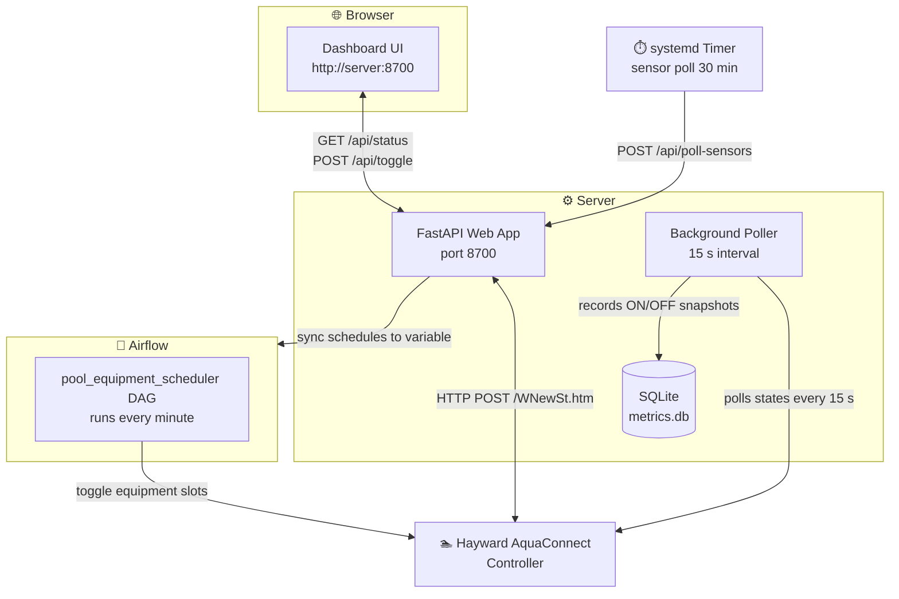

# 🏊 Pool Schedule — Hayward AquaConnect Equipment Scheduler

Automated scheduling, monitoring, and analytics for pool equipment via the [Hayward AquaConnect WebsR2](https://www.hayward.com) controller.

This project combines three components:
- **Airflow DAG** — runs every minute to turn equipment on/off according to configured schedules
- **FastAPI Web Dashboard** — browser-based interface with live status, schedule editing, action history, and runtime analytics
- **systemd timers** — background services for sensor polling and the web app

---

## Table of Contents
- [Overview](#overview)
- [Architecture](#architecture)
- [Prerequisites](#prerequisites)
- [Installation](#installation)
- [Configuration](#configuration)
- [Airflow Setup](#airflow-setup)
- [Web Dashboard](#web-dashboard)
- [Scheduling](#scheduling)
- [Analytics](#analytics)
- [Troubleshooting](#troubleshooting)

---

## Overview

The system controls 9 pieces of pool equipment by sending keypress commands to the Hayward AquaConnect controller's web interface:

| Equipment | Description |
|-----------|-------------|
| `filter` | Pool filter pump |
| `pool` | Pool circulation pump |
| `spa` | Spa jet pump |
| `heater` | Pool/spa heater |
| `cleaner` | In-floor or robotic cleaner |
| `waterfall` | Water feature / waterfall pump |
| `lights` | Pool lighting |
| `spa_light` | Spa lighting |
| `blower` | Spa blower (air jets) |

Plus one menu-navigated item:
| `super_chlorinator` | Saltwater generator super chlorination cycle |

---

## Screenshots

**Status Tab** — Live LCD display, ON/OFF toggles, and health indicators.



**Schedule Tab** — Edit ON/OFF time windows per equipment; supports multiple windows and syncs to Airflow automatically.



**History Tab** — Recent manual toggles with timestamps, details, and Airflow DAG run history.



**Analytics Tab** — KPI tiles, air temp trends, salt level, equipment runtime bar chart, and distribution doughnut.



---

## Architecture



### How it works

1. **Airflow DAG** runs every minute, checks the current time against each equipment's schedule windows, and toggles slots on the controller as needed (idempotent).
2. **Web Dashboard** provides a browser UI at `http://<server>:8700` with:
   - **Status** tab — live LCD display and ON/OFF toggles for each equipment
   - **Schedule** tab — edit ON/OFF time windows per equipment (syncs to Airflow)
   - **History** tab — recent actions and Airflow DAG run history
   - **Analytics** tab — air temp trends, salt level, equipment runtime bar charts, and distribution pie chart
3. **Background poller** — the web app spawns a daemon thread that polls controller equipment states every 15 seconds and records them to SQLite (ensures runtime data is captured even when nobody is viewing the dashboard).
4. **systemd timer** — triggers `/api/poll-sensors` every 30 minutes to read air temperature and salt level from the auto-cycling LCD display.

---

## Prerequisites

| Item | Details |
|------|---------|
| OS | Debian/Ubuntu Linux (tested on Proxmox LXC) |
| Python | 3.12+ |
| Hayward Controller | AquaConnect WebsR2 (firmware that supports local HTTP API at `http://<controller-ip>/WNewSt.htm`) |
| Airflow | Apache Airflow 2.10+ with DAG scheduler enabled |
| Network | Server must be on the same LAN as the Hayward controller |

### Python Dependencies

```bash
pip install fastapi uvicorn jinja2 requests
```

The Airflow DAG requires these Airflow providers (typically included in standard installations):
```bash
pip install apache-airflow-providers-standard
```

---

## Installation

### 1. Clone the repository

```bash
git clone https://github.com/<your-user>/pool-schedule.git
cd pool-schedule
```

### 2. Set up the web app

```bash
# Create a working directory for runtime files
mkdir -p /root/poolschedule/logs

# Copy source files (or symlink)
cp -r web/* /root/poolschedule/

# Create config from template and edit your values
cp config.example.py /root/poolschedule/config.py
nano /root/poolschedule/config.py

# Initialize action history file
echo '[]' > /root/poolschedule/action_history.json

# Install Python dependencies in your virtualenv
cd /root/poolschedule
pip install fastapi uvicorn jinja2 requests
```

### 3. Install systemd services

Copy the files from the `systemd/` directory:

```bash
sudo cp systemd/poolschedule.service /etc/systemd/system/
sudo cp systemd/pool-sensor-poll.timer /etc/systemd/system/
sudo cp systemd/pool-sensor-poll.service /etc/systemd/system/
```

Edit `poolschedule.service` to match your paths (working directory, Python venv, log path):

```bash
sudo nano /etc/systemd/system/poolschedule.service
```

Enable and start the services:

```bash
sudo systemctl daemon-reload
sudo systemctl enable --now poolschedule.service
sudo systemctl enable --now pool-sensor-poll.timer
```

Verify they are running:

```bash
systemctl status poolschedule.service
systemctl list-timers pool-sensor-poll.timer
```

### 4. Verify the web dashboard

Open a browser to `http://<server-ip>:8700` and confirm:
- Status tab shows equipment states from the Hayward controller
- Toggle switches respond (turning equipment on/off)

---

## Configuration

All configuration lives in `web/config.py` (copied from `config.example.py`):

| Setting | Description | Default |
|---------|-------------|---------|
| `AIRFLOW_API_BASE_URL` | Airflow webserver URL | `http://127.0.0.1:8080` |
| `AIRFLOW_USERNAME` | Airflow API username | `admin` |
| `AIRFLOW_PASSWORD` | Airflow API password | *(set yours)* |
| `AIRFLOW_DAG_ID` | DAG identifier in Airflow | `pool_equipment_scheduler` |
| `AIRFLOW_VARIABLE_KEY` | Airflow Variable name for schedules | `pool_schedules` |
| `HAYWARD_CONTROLLER_URL` | Hayward controller IP/hostname | *(your controller IP)* |
| `TIMEZONE` | Timezone for schedule windows | `America/New_York` |
| `APP_PORT` | Web dashboard port | `8700` |
| `DASHBOARD_REFRESH_INTERVAL` | Browser auto-refresh in seconds | `15` |

> **Security:** Never commit `config.py` with real credentials. It is listed in `.gitignore`.

---

## Airflow Setup

### 1. Deploy the DAG

```bash
# Copy DAG files to your Airflow dags folder
cp airflow-dag/pool_equipment_scheduler_dag.py <AIRFLOW_HOME>/dags/
cp airflow-dag/pool_controller.py <AIRFLOW_HOME>/dags/
```

Both files must be in the same `dags/` directory. The DAG imports from `pool_controller`.

### 2. Set Airflow Variables

You can set them via the Airflow UI (**Admin → Variables**) or CLI:

```bash
# Controller URL (same as HAYWARD_CONTROLLER_URL in config.py)
airflow variables --set pool_controller_url "http://172.16.0.26"

# Timezone for schedule windows
airflow variables --set pool_timezone "America/New_York"

# Equipment schedules — see [Schedule Format](#schedule-format) below
airflow variables --set pool_schedules '{"filter": {"on": "05:00", "off": "23:00"}}'
```

### 3. Maintenance Window

The DAG has a **maintenance window** (default: 7:00 AM → 12:30 AM) during which equipment tasks are skipped so your manual settings aren't overridden. The scheduler is active only between 12:30 AM and 6:59 AM.

Edit `MAINTENANCE_START` and `MAINTENANCE_END` in `pool_equipment_scheduler_dag.py` to change this window (values are minutes since midnight).

---

## Web Dashboard

Once the web app is running at `http://<server>:8700`, you get four tabs:

### Status Tab
- Live LCD display showing current Hayward controller screen
- ON/OFF toggle switches for each equipment (click to manually toggle)
- Auto-refreshes every 15 seconds (configurable)
- Health indicators for controller connectivity and Airflow API

### Schedule Tab
- Visual editor with ON/OFF time inputs per equipment
- Supports **multiple time windows** per equipment (click `+` to add)
- Click the checkbox to disable scheduling for a piece of equipment
- **Save Schedule** button writes local JSON and syncs to the Airflow Variable

### History Tab
- Local action log (manual toggles, schedule saves)
- Airflow DAG run history (last 20 runs with state and duration)

### Analytics Tab
- KPI tiles: current air temp, salt level, filter/heater hours (7d)
- **Air Temperature Trend** — line chart of daily averages/min/max
- **Equipment Runtime (7d)** — bar chart showing hours-ON per equipment
- **Salt Level Trend** — line chart of daily salt ppm
- **Runtime Distribution** — doughnut chart showing relative runtime share

---

## Scheduling

### Schedule Format

Schedules are stored as JSON in the Airflow Variable `pool_schedules` and locally in `schedules.json`. Each equipment has either a single time window or a list of windows:

```json
{
  "filter": { "on": "05:00", "off": "23:00" },
  "cleaner": [
    { "on": "01:10", "off": "04:50" },
    { "on": "05:20", "off": "05:40" }
  ],
  "spa": { "on": "19:00", "off": "22:00" },
  "lights": null
}
```

- **Single window:** `{ "on": "HH:MM", "off": "HH:MM" }`
- **Multiple windows:** `[ { "on": "...", "off": "..." }, ... ]`
- **Disabled:** `null` or omitted from the dict

**Overnight windows** are supported (e.g., `"on": "22:00", "off": "06:00"`).

### Editing Schedules

Schedules can be edited in two ways:
1. **Web Dashboard** → Schedule tab → edit times → click Save Schedule (preferred)
2. **Airflow CLI:** `airflow variables --set pool_schedules '{...}'`
3. **Direct file edit:** `schedules.json` (must also sync to Airflow Variable manually)

---

## Analytics

### How Runtime Data is Collected

The web app's background poller thread queries the Hayward controller every 15 seconds and records each equipment's ON/OFF state to a SQLite database (`metrics.db`). The analytics queries then:

- Count ON snapshots per equipment per day
- Convert to hours: `hours = count × 15s / 3600` (since each snapshot represents ~15 seconds of runtime)

**This runs continuously in the background** — equipment states are recorded whether or not anyone has the dashboard open in a browser. This ensures overnight spa, cleaner, and heater runtimes are captured accurately.

### Sensor Data

Air temperature and salt level readings are collected via a systemd timer that triggers `/api/poll-sensors` every 30 minutes. The poller navigates the Hayward LCD's auto-cycling display pages (5 snapshots with 4-second gaps) to catch temperature and salt values.

### Data Retention

- Equipment states: pruned to **90 days** on each insert
- Sensor readings: pruned to **90 days** on each insert

---

## Troubleshooting

### Web app won't start

```bash
# Check the systemd service status
systemctl status poolschedule.service

# View recent logs
journalctl -u poolschedule.service --no-pager -n 50

# Or check the log file directly
tail -100 /root/poolschedule/logs/app.log
```

### Controller connection fails

- Verify `HAYWARD_CONTROLLER_URL` in `config.py` points to the correct IP
- Test connectivity: `curl http://<controller-ip>/WNewSt.htm -d "Update Local Server&"`
- Check that the server is on the same LAN/VLAN as the Hayward controller

### Analytics shows zero hours for equipment that ran

The background poller records states every 15 seconds. Verify it's working:

```bash
sqlite3 /root/poolschedule/metrics.db "SELECT COUNT(*) FROM equipment_states WHERE timestamp >= datetime('now', '-1 hour');"
```

You should see ~240+ rows (9 equipments × 4 time periods = 36 records per cycle, ~4 cycles per minute).

### Airflow DAG tasks are failing

- Check the `pool_controller_url` Airflow Variable matches your controller IP
- Verify the `pool_schedules` variable contains valid JSON matching the expected format
- Check DAG run logs in the Airflow UI for specific errors

### Hayward controller returns HTML with "xxx" delimiters but wrong state

The LED byte encoding uses nibble values (3=NOKEY, 4=OFF, 5=ON, 6=BLINK). If all equipment shows OFF or UNKNOWN, verify the controller is responding correctly by checking the raw response:

```python
import requests
r = requests.post("http://<controller-ip>/WNewSt.htm", data=b"Update Local Server&")
print(r.text)
```

---

## Project Structure

```
pool-schedule/
├── README.md                 # This file
├── LICENSE                   # MIT License
├── config.example.py         # Template for web app configuration
├── .gitignore                # Excludes credentials and runtime files
├── screenshots/              # Dashboard screenshots (Status, Schedule, History, Analytics)
├── web/                      # FastAPI web dashboard
│   ├── app.py               # Main application (FastAPI + uvicorn)
│   ├── config.py            # ← NOT committed; copy from config.example.py
│   ├── controller.py        # Hayward AquaConnect HTTP protocol client
│   ├── airflow_client.py    # Airflow REST API client (variables, DAG runs)
│   ├── local_store.py       # Local JSON storage for schedules & history
│   ├── metrics.py           # SQLite time-series store (sensor + equipment)
│   ├── static/
│   │   ├── app.js           # Client-side JS (tabs, toggles, charts)
│   │   └── style.css        # Dashboard styling (dark/light theme)
│   └── templates/
│       ├── base.html        # Jinja2 base layout
│       └── dashboard.html   # Main dashboard page with all tabs
├── airflow-dag/              # Apache Airflow DAG files
│   ├── pool_equipment_scheduler_dag.py  # DAG definition (runs every minute)
│   └── pool_controller.py     # Controller client for Airflow tasks
└── systemd/                  # Systemd service and timer units
    ├── poolschedule.service           # Web app service
    ├── pool-sensor-poll.service       # Sensor poll one-shot
    └── pool-sensor-poll.timer         # 30-minute sensor poll schedule
```

---

## License

[MIT License](LICENSE) — free to use, modify, and share.
